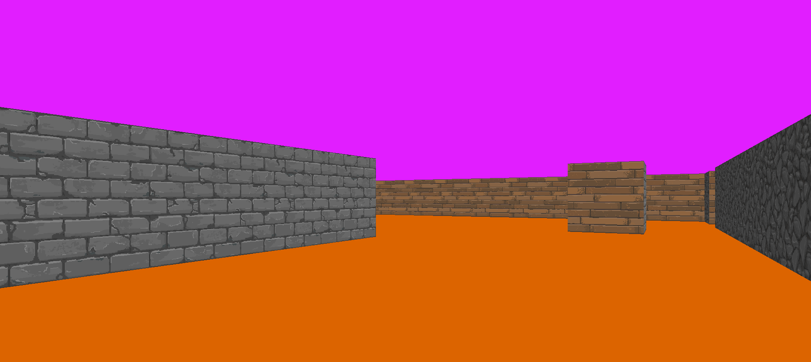

# cub3D

A simple game from scratch with Raycasting

Inspired by Wolfenstein 3D



## Maps and textures

Exemple maps and textures are in ```/assets```

Maps are the ```.cub``` files and textures the ```.xpm``` files

> [!NOTE]
> The game support only XPM textures

### Maps format

Maps are formated like this

```cub
NO assets/Brick.xpm       //Texture for the North direction
SO assets/Stone.xpm       //Texture for the South direction
WE assets/Tiles.xpm       //Texture for the West direction
EA assets/Wood.xpm        //Texture for the East direction

F 220,100,0               //Floor color R,G,B with each component between 0 and 255
C 225,30,255              //Ceiling color

111111111111111111111111111111111
100000000000000000000000000001111
110111111111111111111111111111111
100000000000000000000000000000001
100010000000000000000000000000001
100000000000000000000000000000001
100000000000000000000000000000001
100000011111111111111110000000001
100000000000001000000000000000001
1000000000000010000000000000000011
1000000000000010000000111111111111
1000000000000010000000001000000001
1000000000000010000000001111111111
111111111111111111111111111111111
```

At the end it's the map itself, it need to be surrounded by walls (1),
0 are for empty cells
